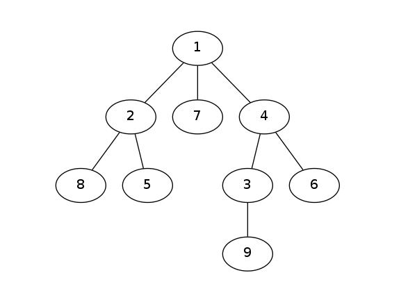

剪枝是提高搜索算法时空效率，使得算法在优越性上大大优化的技巧。有的时候暴力搜索（也叫爆搜）过不了时限的算法，通过各种剪枝+优化之后就能成功通过。可见剪枝的重要性。无论是正解搜索算法还是想不到正解无奈之下选择的骗分算法，剪枝都是一类不得不学、不得不会的知识点。
# 剪枝的概念
我们知道，所谓深搜和广搜（宽搜），其本质上都是对一棵搜索树的深度、广度优先遍历。无论是图论类型的题目，还是正常的传统性题目都是如此。把握这个性质也是我们设计搜索算法时最重要的思路。

那么，下图展示了一棵搜索树：

对于这棵树来讲，以深度优先遍历为例，从1节点开始深搜，若要完全遍历，则需要搜索所有的节点。但是在解决实际问题的过程中，我们往往可以发现，有一些点和它们的子节点显然不符合题意，压根就没必要进行搜索。那么我们就在算法中加入一个判断条件，使得这棵子树在搜索的时候不会被进入，以此优化时空复杂度。因为这个优化的技巧非常像在树上砍冗余的枝条，所以起了一个名字叫做：剪枝。

# 剪枝的几种常见方式
那么，剪枝如何来实现呢？

我们来看几种常见的剪枝手段和算法设计思想。

为了方便读者阅读，我先把搜索树挂上：

1、可行性剪枝
所谓可行性剪枝，顾名思义，就是当当前状态和题意不符，并且由于题目可以推出，往后的所有情况和题意都不符，那么就可以进行剪枝，直接把这种情况及后续的所有情况判负，直接返回。

即：不可行，就返回。

2、排除等效冗余
所谓排除等效冗余，就是当几个枝桠具有完全相同的效果的时候，只选择其中一个走就可以了。

即：都可以，选一个。

3、最优性剪枝
所谓最优性剪枝，是在我们用搜索方法解决最优化问题的时候的一种常用剪枝。就是当你搜到一半的时候，已经比已经搜到的最优解要不优了，那么这个方案肯定是不行的，即刻停止搜索，进行回溯。

即：有比较，选最优。

4、顺序剪枝
普遍来讲，搜索的顺序是不固定的，对一个问题来讲，算法可以进入搜索树的任意的一个子节点。但假如我们要搜索一个最小值，而非要从最大值存在的那个节点开搜，就可能存在搜索到最后才出解。而我们从最小的节点开搜很可能马上就出解。这就是顺序剪枝的一个应用。一般来讲，有单调性存在的搜索问题可以和贪心思想结合，进行顺序剪枝。

即：有顺序，按题意。

5、记忆化
记忆化搜索其实是搜索的另外一个分支。在这里简单介绍一下记忆化的原理：

就是记录搜索的每一个状态，当重复搜索到相同的状态的时候直接返回。

即：搜重了，直接跳。

>[浅谈几种常见的剪枝方式](https://www.cnblogs.com/fusiwei/p/11759489.html)