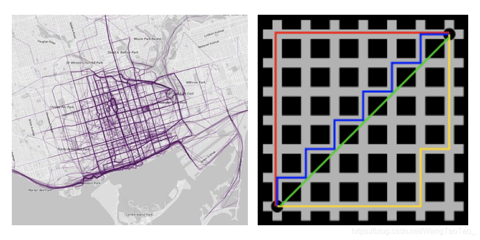
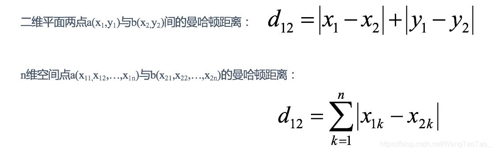

在曼哈顿街区要从一个十字路口开车到另一个十字路口，驾驶距离显然不是两点之前的直线距离。这个实际的驾驶距离就是"曼哈顿距离"。曼哈顿距离也称“城市街区距离”。

>[距离向量（欧式距离、曼哈顿距离等）](https://blog.csdn.net/WangTaoTao_/article/details/102973124)

# 求解方式
在一个图中，能从一个点出发求这种最短距离的方法很容易想到就是 [BFS](../算法/广度优先搜索.md)，BFS 的名称是广度优先遍历，即把周围这一圈搜索完成之后，再搜索下一圈，是慢慢扩大搜索范围的。