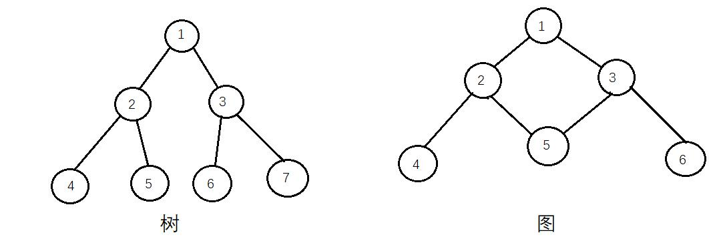

# 一、树
> 转载至：[蓝海人：二叉树、前序遍历、中序遍历、后序遍历](https://www.cnblogs.com/lanhaicode/p/10358736.html)

在谈二叉树前先谈下树和图的概念
树：不包含回路的连通无向图（树是一种简单的非线性结构）

树有着不包含回路这个特点，所以树就被赋予了很多特性

1. 一棵树中任意两个结点有且仅有唯一的一条路径连通
2. 一棵树如果有n个结点，那它一定恰好有n-1条边
3. 在一棵树中加一条边将会构成一个回路
4. 树中有且仅有一个没有前驱的结点称为根结点

 

在对树进行讨论的时候将树中的每个点称为结点，

根结点：没有父结点的结点

叶结点：没有子结点的结点

内部结点：一个结点既不是根结点也不是叶结点

每个结点还有深度，比如上图左边的树的4号结点深度是3（深度是指从根结点到这个结点的层数，根结点为第一层）