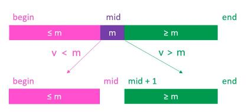
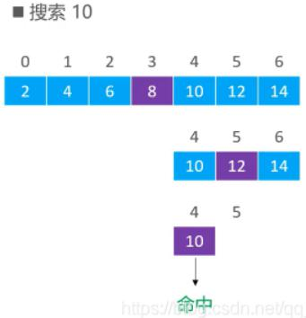
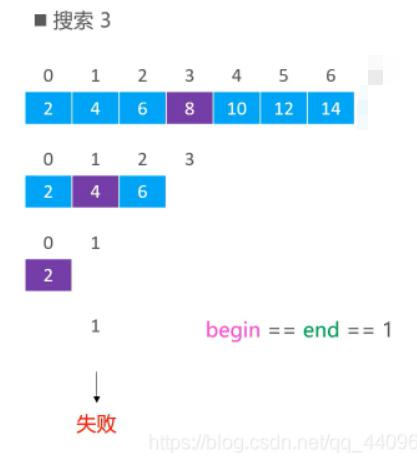

# 二分搜索
二分搜索，简单来讲就是如何从一个有序数列中快速得到某个值的位置。

当数列**没有重复**元素的时候，即为[寻找一个数](#寻找一个数)

当数列**有重复**元素的时候，即为[寻找边界](#寻找边界)

# 寻找一个数
基本的二分搜索，给定一个**没有重复元素的有序数列**，查找某个值的位置

## 思路分析
网上有很多关于二分法细节的文章，我看了一圈下来，认为两边都是闭区间的思路是好理解的，也是好记忆的，并且能够用图记住细节问题，所以本文整体都采用了左闭右开这个思路。

假设在[begin，end]范围内搜索某个元素 v，mid =（begin + end）/ 2

1. 如果v < m，去[begin ， mid-1]范围内二分搜索
2. 如果v > m，去[mid + 1， end]范围内二分搜索
3. 如果v == m ，直接返回 mid

end指的是数组的长度。


## 实例




## 实现代码
``` c++
  int search(vector<int>& nums, int target) {
        int left = 0;
        int right = nums.size() - 1;
        while(left <= right){
			 //不可使用int mid = left/2 + right/2;取整原因，可能会导致丢失数值
            int mid = left + (right - left) /2;  实现中位数的计算，由于向下取整操作，
            if(nums[mid] == target){
                return mid;
            }else if(nums[mid] > target){
                right = mid - 1;
            }else if(nums[mid] < target){
                left = mid + 1;
            }
        }
        return -1;
    }
```

## 适用场景
[有序数列搜索问题](../适用场景/搜索问题.md#输出元素位置)

## 试题
[704. 二分查找](https://leetcode-cn.com/problems/binary-search/)

[278. 第一个错误的版本](https://leetcode-cn.com/problems/first-bad-version/)

[35. 搜索插入位置](https://leetcode-cn.com/problems/search-insert-position/)

>关于最后返回值的一些思考：

>当使用```while(left <= right)```作为循环入口的时候，跳出循环的情况是```left>right```，所以循环最后一次执行的情况必定是```left==right```并且**已经搜索到边界**的情况，可以根据这一点，分析一些具体场景在返回值时的选项，到底返回left还是right还是mid的值


# 寻找边界

给定一个**含有重复元素的有序数列**，查找某个值的左边界或者右边界

## 思路分析

假设在[left，right]范围内搜索某个元素 v，mid =（left + right）/ 2

1. 如果v < m，去[left ， mid-1]范围内二分搜索
2. 如果v > m，去[mid + 1， right]范围内二分搜索
--------------------------------------------------
- **查找左边界**
3. 查找**左边界**：如果v == m，则收紧右边界，去[left， mid - 1]范围内二分搜索
4. 检查 left 越界的情况
``` c++
	if (left >= nums.length || nums[left] != target)
        return -1;
```
5. 返回**left**值
--------------------------------------------------
- **查找右边界**
3. 查找**右边界**：如果v == m，则收紧左边界，去[mid + 1，right]范围内二分搜索
4. 检查right情况
``` c++
  if (right < 0 || nums[right] != target)
        return -1;
```
5. 返回**right**值

right指的是数组的长度。


<!-- > 关于最后左右边界的一些思考：
> 左右边界其实记一个就行了，当都是整数的时候，右边界查找的结果就等于，寻找 target+1 的左边界结果 -1
 -->

## 实例


## 实现代码
``` c++
	// 查找左边界
	int left_bound(vector<int>& nums, int target) {
		int left = 0, right = nums.size() - 1;
		while (left <= right) {
			int mid = left + (right - left) / 2;
			if (nums[mid] < target) {
				left = mid + 1;
			} else if (nums[mid] > target) {
				right = mid - 1;
			} else if (nums[mid] == target) {
				// 别返回，锁定左侧边界
				right = mid - 1;
			}
		}
		// 最后要检查 left 越界的情况
		if (left >= nums.length || nums[left] != target)
			return -1;
		return left;
	}
	// 查找右边界
	int right_bound(vector<int>& nums, int target) {
		int left = 0, right = nums.size() - 1;
		while (left <= right) {
			int mid = left + (right - left) / 2;
			if (nums[mid] < target) {
				left = mid + 1;
			} else if (nums[mid] > target) {
				right = mid - 1;
			} else if (nums[mid] == target) {
				// 别返回，锁定右侧边界
				left = mid + 1;
			}
		}
		// 最后要检查 right 越界的情况
		if (right < 0 || nums[right] != target)
			return -1;
		return right;
	}

```

## 适用场景
[有序数列搜索问题](../适用场景/搜索问题.md#输出元素位置)

## 试题
[34. 在排序数组中查找元素的第一个和最后一个位置](https://leetcode-cn.com/problems/find-first-and-last-position-of-element-in-sorted-array/)