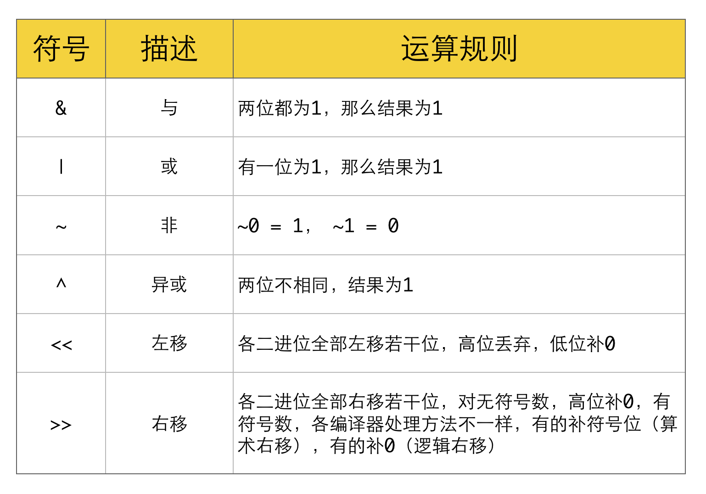
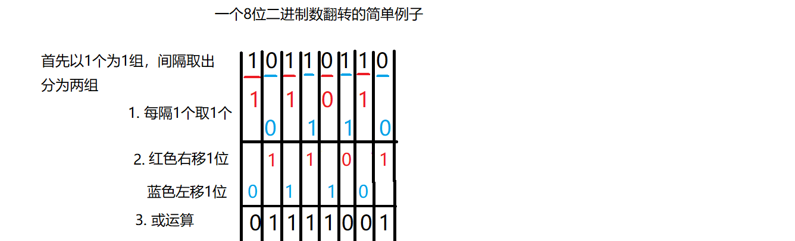
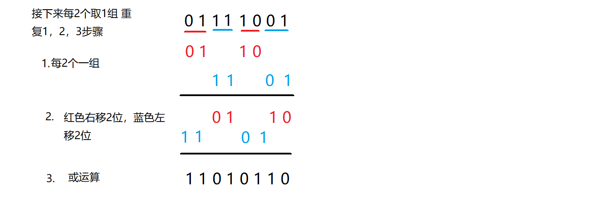
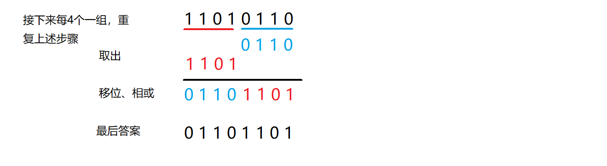

- 常用位操作
1. 判断奇偶
 - (x & 1) == 1 ---等价---> (x % 2 == 1)
 - (x & 1) == 0 ---等价---> (x % 2 == 0)
2. x / 2 ---等价---> x >> 1
3. x &= (x - 1) ------> 把x最低位的二进制1给去掉
4. x & -x -----> 得到最低位的1
5. x & ~x -----> 0
- 指定位置的位运算
1. 将X最右边的n位清零：x & (~0 << n)
2. 获取x的第n位值：(x >> n) & 1
3. 获取x的第n位的幂值：x & (1 << n)
4. 仅将第n位置为1：x | (1 << n)
5. 仅将第n位置为0：x & (~(1 << n))
6. 将x最高位至第n位（含）清零：x & ((1 << n) - 1)
7. 将第n位至第0位（含）清零：x & (~((1 << (n + 1)) - 1))
- 异或结合律

```
1. x ^ 0 = x, x ^ x = 0
2. x ^ (~0) = ~x, x ^ (~x) = ~0
3. a ^ b = c, a ^ c = b, b ^ c = a
(有没有点乘法结合律的意思)
字母表示：(a ^ b) ^ c = a ^ (b ^ c)
图形表示：(☆ ^ ◇) ^ △ = ☆ ^ (◇ ^ △)
```


- 大小字母位运算技巧
（2021-05-09 更新）

 - 大写变小写、小写变大写：字符 ^= 32 （大写 ^= 32 相当于 +32，小写 ^= 32 相当于 -32）
 - 大写变小写、小写变小写：字符 |= 32 （大写 |= 32 就相当于+32，小写 |= 32 不变）
 - 大写变大写、小写变大写：字符 &= -33 （大写 ^= -33 不变，小写 ^= -33 相当于 -32）
 
 


>[5种解法，你应该背下的位操作知识](https://leetcode-cn.com/problems/power-of-two/solution/5chong-jie-fa-ni-ying-gai-bei-xia-de-wei-6x9m/)


一图看懂分治方法求解


