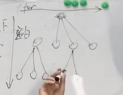
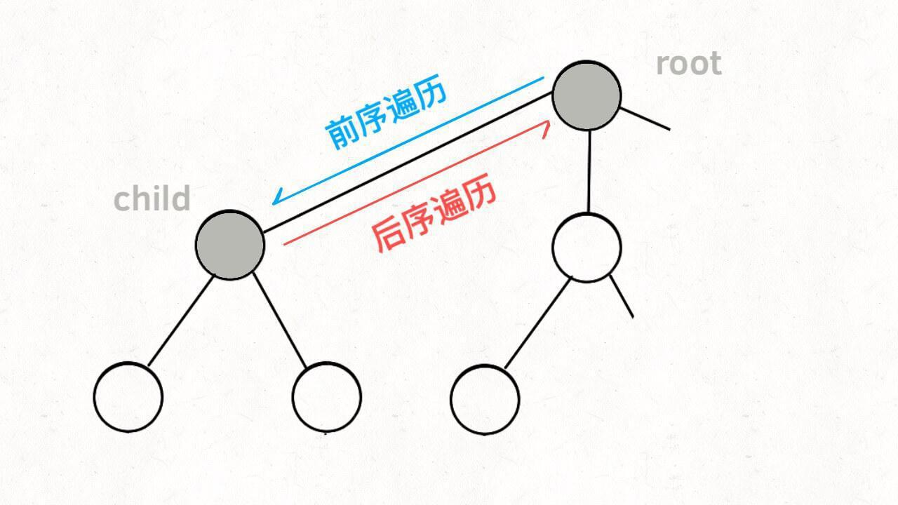

# 回溯法
>[回溯算法理论基础](https://programmercarl.com/%E5%9B%9E%E6%BA%AF%E7%AE%97%E6%B3%95%E7%90%86%E8%AE%BA%E5%9F%BA%E7%A1%80.html)
- 如果解决一个问题有多个步骤，每一个步骤有多种方法，题目又要我们找出所有的方法，可以使用回溯算法；
- 回溯算法是在一棵树上的 深度优先遍历（因为要找所有的解，所以需要遍历）；
- 组合问题，相对于排列问题而言，不计较一个组合内元素的顺序性（即 [1, 2, 3] 与 [1, 3, 2] 认为是同一个组合），因此很多时候需要按某种顺序展开搜索，这样才能做到不重不漏。

## 相关问题
- 组合问题
- 切割问题
- 子集问题
- 排列问题
- 棋盘问题

## 抽象
抽象为一个树形结构，n叉树
平向是for循环，纵向是递归


递归是深度遍历，递归内部是横向的遍历

递归和for循环的关系


## 回溯算法框架
```python3
void backtracking(参数) {
    if (终止条件) {
        存放结果;
        return;
    }

    for (选择：本层集合中元素（树中节点孩子的数量就是集合的大小）) {
        处理节点;
        backtracking(路径，选择列表); // 递归
        回溯，撤销处理结果
    }
}
```
# 回溯法前序遍历

```java

void traverse(TreeNode root) {
    for (TreeNode child : root.childern)
        // 前序遍历需要的操作
        traverse(child);
        // 后序遍历需要的操作
}

```
# 回溯法后序遍历


多叉树的遍历框架
```
void traverse(TreeNode root) {
    for (TreeNode child : root.childern)
        // 前序遍历需要的操作
        traverse(child);
        // 后序遍历需要的操作
}
```

前序遍历的代码在进入某一个节点之前的那个时间点执行，后序遍历代码在离开某个节点之后的那个时间点执行。
-[19. 删除链表的倒数第 N 个结点（中等）](https://leetcode-cn.com/problems/remove-nth-node-from-end-of-list/)
``` java
class Solution {
     public ListNode removeNthFromEnd(ListNode head, int n) {
    	int traverse = traverse(head, n);
    	if(traverse == n)
    	    return head.next;
    	return head;
    }
    
    private int traverse(ListNode node, int n) {
        if(node == null)
            return 0;
        int num = traverse(node.next, n);
        if(num == n)
            node.next = node.next.next;
        return num + 1;
    }
}
```