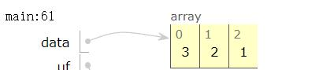
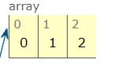
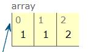

通过维护一个父节点数组，由于每个节点的索引值是唯一的，所以每个节点的父节点有唯一值，
例如原数组为：[3,2,1] ，索引值为0,1,2

- 初始化

初始父节点数组为parent = [0,1,2]即：parent[0]=0,parent[1]=1,parent[2]=2

- 联通

此时将0、1的值进行联通，则parent=[0,0,2]或者[1,1,2]

- 判断
在parent[1,1,2]中，其中parent[1]和parent[2]为