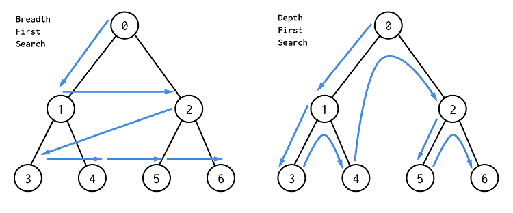

我们知道，所谓深搜和广搜（宽搜），其本质上都是对一棵搜索树的深度、广度优先遍历。无论是图论类型的题目，还是正常的传统性题目都是如此。把握这个性质也是我们设计搜索算法时最重要的思路。

在一个图中，能从一个点出发求这种最短距离的方法很容易想到就是 BFS，BFS 的名称是广度优先遍历，即把周围这一圈搜索完成之后，再搜索下一圈，是慢慢扩大搜索范围的。

# 广度优先算法
利用循环实现技巧
广度优先搜索即，一边又一遍搜索
## 模板
1. 如果不需要确定当前遍历到了哪一层，BFS 模板如下。

```
while queue 不空：
    cur = queue.pop()
    for 节点 in cur的所有相邻节点：
        if 该节点有效且未访问过：
            queue.push(该节点)
```

2. 如果要确定当前遍历到了哪一层，BFS 模板如下。
这里增加了 level 表示当前遍历到二叉树中的哪一层了，也可以理解为在一个图中，现在已经走了多少步了。size 表示在当前遍历层有多少个元素，也就是队列中的元素数，我们把这些元素一次性遍历完，即把当前层的所有元素都向外走了一步。
```
level = 0
while queue 不空：
    size = queue.size()
    while (size --) {
        cur = queue.pop()
        for 节点 in cur的所有相邻节点：
            if 该节点有效且未被访问过：
                queue.push(该节点)
    }
    level ++;
```
## 试题
- [733. 图像渲染（简单）](https://leetcode-cn.com/problems/flood-fill/)
- [695. 岛屿的最大面积（中等）](https://leetcode-cn.com/problems/max-area-of-island/)
- [542. 01 矩阵（中等）](https://leetcode-cn.com/problems/01-matrix/submissions/)
- 
> [套路大解密：搞懂题目考察什么，剩下的任务就是套模板！](https://leetcode-cn.com/problems/01-matrix/solution/tao-lu-da-jie-mi-gao-dong-ti-mu-kao-cha-shi-yao-2/)

# 深度优先搜索

常用的解法是：递归
在递归的过程中需要添加一个缓存变量，防止走重复的路径。

## 例题
- [733. 图像渲染（简答）](https://leetcode-cn.com/problems/flood-fill/)
- [695. 岛屿的最大面积（中等）](https://leetcode-cn.com/problems/max-area-of-island/)
- [617. 合并二叉树（简单）](https://leetcode-cn.com/problems/merge-two-binary-trees/)
- [116. 填充每个节点的下一个右侧节点指针（中等）](https://leetcode-cn.com/problems/populating-next-right-pointers-in-each-node/)