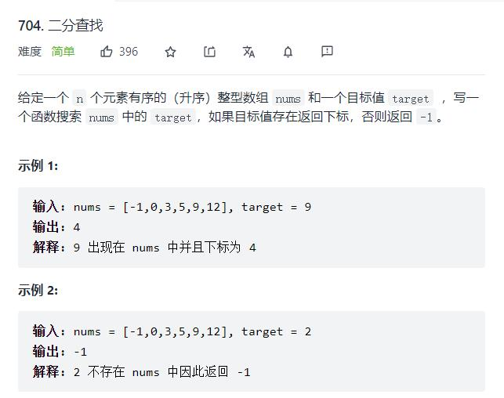
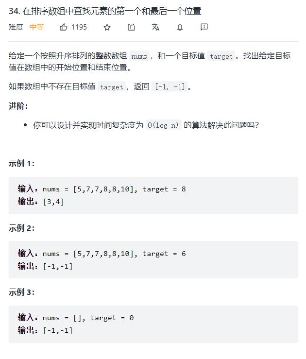

# 搜索问题
查找问题

输入值有：[有序元素列表](#输入为有序的元素列表)、

输出值有：元素的位置

# 输入：有序的元素列表，某一值

## 输出：元素位置

### 场景描述
给你一个升序/降序的列表，让你找出某个值的位置

### 适用算法
[二分搜索](../算法/二分搜索.md)

<!-- ### 力扣题目
- [704. 二分查找](https://leetcode-cn.com/problems/binary-search/)
- [278. 第一个错误的版本](https://leetcode-cn.com/problems/first-bad-version/)
- [35. 搜索插入位置](https://leetcode-cn.com/problems/search-insert-position/)

 -->
## 输出：元素左右边界

### 场景描述
给你一个升序/降序的列表，该值的左边界或右边界

### 适用算法
[二分搜索#寻找边界](../算法/二分搜索.md#寻找边界)

<!-- 
### 力扣题目
 - [34. 在排序数组中查找元素的第一个和最后一个位置](https://leetcode-cn.com/problems/find-first-and-last-position-of-element-in-sorted-array/) -->